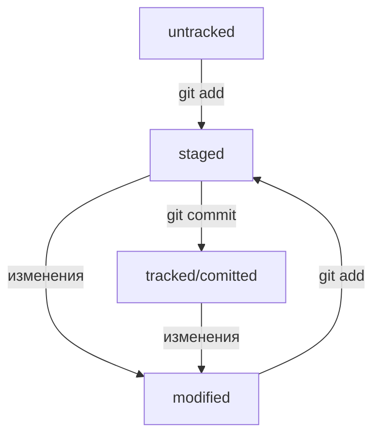

# Шпаргака по Git
---
## Основные команды для работы с репозиториями
### 1. Создание репозитория
Сделать папку репозиторием — git init

_Чтобы Git начал отслеживать изменения в проекте, папку с файлами этого проекта нужно сделать Git-репозиторием (от англ. repository — «хранилище»). Для этого следует переместиться в неё и ввести команду git init (от англ. initialize — «инициализировать»)._

### 2. Удаление созданного репозитория
«Разгитить» папку, если что-то пошло не так, — rm -rf .git

_Если вы случайно сделали Git-репозиторием не ту папку, её можно «разгитить». Для этого нужно удалить скрытую подпапку .git._

### 3. Проверка состояния репозитория
Проверить состояние репозитория — git status

_После инициализации репозитория first-project запустите команду git status (от англ. status — «статус», «состояние») — она показывает текущее состояние репозитория._

### 4. Добавление файлов в репозиторий
Подготовить файлы к сохранению — git add <имя файлв>

_Также можно добавить текущую папку целиком — в этом случае все файлы в ней тоже будут добавлены. Обратиться к текущей папке в Bash позволяет точка (.).: git add ._

 _Добавить все файлы - git add --all_
 
### 5. Фиксация изменений
Выполнить коммит — git commit

_Сделать коммит можно командой git commit c ключом -m (от англ. message — «сообщение»), который присваивает коммиту сообщение._

### 6. История коммитов
Просмотреть историю коммитов — git log

Посмотреть историю коммитов в сокращенном виде - git log --oneline

### 7. Связывание репозиториев
Привязать удалённый репозиторий к локальному — git remote add

### 8. Синхронизация репозиториев
Отправить изменения на удалённый репозиторий — git push

## Хэши
_Хеш_ — основной идентификатор коммита

Git хранит таблицу соответствий хеш → информация о коммите. Если вы знаете хеш, вы можете узнать всё остальное: автора и дату коммита и содержимое закоммиченных файлов. Можно сказать, что хеш — основной идентификатор коммита.

Все хеши и таблицу хеш → информация о коммите Git сохраняет в служебные файлы. Они находятся в скрытой папке .git в репозитории проекта.

## Логи
После вызова git log появляется список коммитов.

Элементы, из которых состоит описание:
1. строка из цифр и латинских букв после слова commit — это хеш коммита;
2. Author — имя автора и его электронная почта;
3. Date — дата и время создания коммита;
4. В конце находится сообщение коммита.

## Файл HEAD
Файл HEAD (англ. «голова», «головной») — один из служебных файлов папки .git. 

Он указывает на коммит, который сделан последним (то есть на самый новый).

Внутри HEAD — ссылка на служебный файл: refs/heads/master (или refs/heads/main в зависимости от названия ветки). Если заглянуть в этот файл, можно увидеть хеш последнего коммита.

## Статусы файлов в Git
Одна из ключевых задач Git — отслеживать изменения файлов в репозитории. Для этого каждый файл помечается каким-либо статусом

### 1.untracked (англ. «неотслеживаемый»)

Мы говорили, что новые файлы в Git-репозитории помечаются как untracked, то есть неотслеживаемые. Git «видит», что такой файл существует, но не следит за изменениями в нём. У untracked-файла нет предыдущих версий, зафиксированных в коммитах или через команду git add.

### 2.staged (англ. «подготовленный»)

После выполнения команды git add файл попадает в staging area, то есть в список файлов, которые войдут в коммит. В этот момент файл находится в состоянии staged.

### 3.tracked (англ. «отслеживаемый»)

Состояние tracked — это противоположность untracked. Оно довольно широкое по смыслу: в него попадают файлы, которые уже были зафиксированы с помощью git commit, а также файлы, которые были добавлены в staging area командой git add. То есть все файлы, в которых Git так или иначе отслеживает изменения.

###4. modified (англ. «изменённый»)

Состояние modified означает, что Git сравнил содержимое файла с последней сохранённой версией и нашёл отличия.

### Диаграмма жизненного цикла файлов проекта

 
